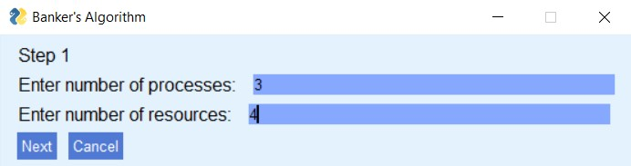
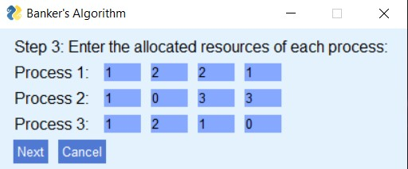
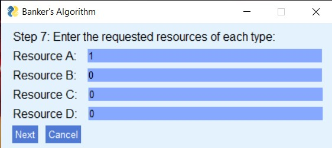
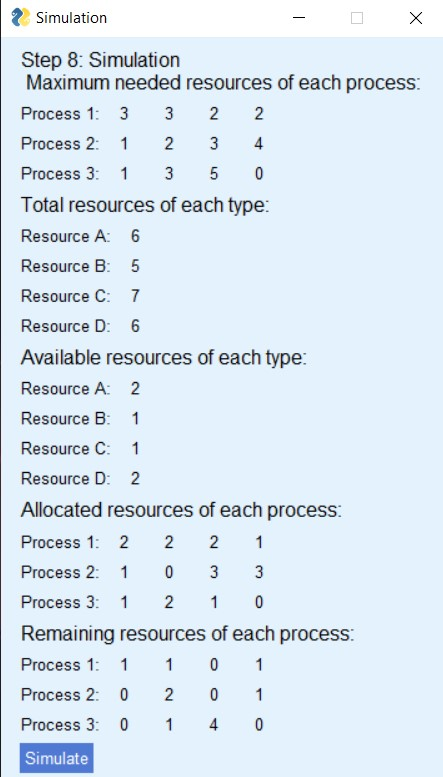

# Banker's Algorithm
This is a project which implements banker's algorithm. Banker's algorithm is a deadlock avoidance algorithm used to detect whether a system is safe or unsafe. This project simulates the banker's algorithm and takes the used step by step towards building a system of processes and resources checking whether a deadlock occurs in that system or not.


## Getting Started

### Dependencies

* Python 3.4+, PySimpleGUI
* ex. Windows 10, Linux, Mac

### Installing
```
pip install PySimpleGUI numpy
```

### Executing program

* To run this application


```
python Bankers'sAlgorithm
```
## Features

- Step by step simulation
- Easily operated and convenient GUI
- Ability to accept resource requests from user
- Ability to detect whether the system is safe or causes a deadlock


## Screenshots
- Below are some screenshots the feature some of the parts of the graphical user interface











## License

[MIT](https://choosealicense.com/licenses/mit/)


